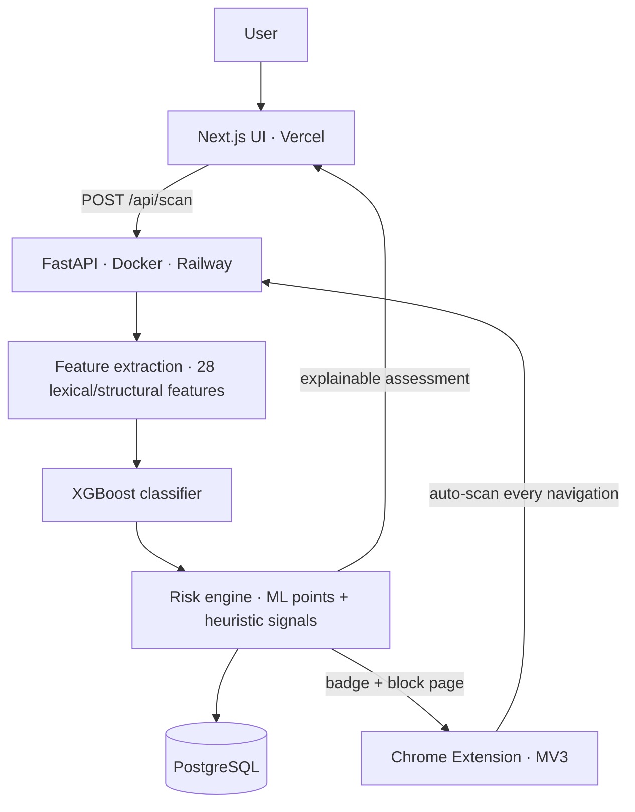

# 🛡️ PhishGuard — Know Before You Click

**AI-powered URL security intelligence.** PhishGuard combines a trained XGBoost classifier with a transparent, rule-based risk engine to assess any URL, and shows the user exactly *why* a link is safe or dangerous.

- 🔗 **Live app:** https://phishguard-ten-ruddy.vercel.app
- ⚡ **API + docs:** https://phishguard-production-7b6e.up.railway.app/docs
- 🧩 **Browser extension:** real-time protection in Chrome, see [`extension/`](extension/)

---

## Architecture



## How it works

1. **Feature extraction.** 28 features are computed from the URL string alone (lengths, subdomains, entropy, digits, hyphens, suspicious TLDs, IP hosts, shorteners, punycode and more). No page is ever visited, so analyzing a hostile link is safe for the user and instant.
2. **ML classification.** An XGBoost model trained on the [PhiUSIIL Phishing URL Dataset](https://archive.ics.uci.edu/dataset/967/phiusiil+phishing+url+dataset) (~235k URLs). Three candidates (Logistic Regression, Random Forest, XGBoost) were evaluated, and the final model was selected on validation F1 (**0.9976**; test F1 **0.9978**, ROC-AUC **0.9988**). SHAP analysis shows `is_https`, `path_length`, `num_subdomains` and `url_length` as the dominant drivers.
3. **Risk engine.** The ML probability is combined with heuristic signals (brand impersonation, suspicious keywords, abuse-prone TLDs, IP hosts, shorteners and more) into a 0–100 score: `SAFE → LOW → MEDIUM → HIGH → CRITICAL`. Every point is attributable, and the UI shows the exact composition (e.g. *"ML 70 pts + heuristics 30 pts"*).
4. **Delivery.** A FastAPI + PostgreSQL backend, a Next.js dashboard, and a Chrome extension that scans every navigation, badges each tab with its risk score, and blocks HIGH/CRITICAL pages with a full explanation.

## API

| Endpoint | Purpose |
|---|---|
| `POST /api/scan` | Full assessment (features, ML probability, signals, breakdown). Use `?save=false` for stateless scans |
| `GET /api/history` | Paginated scan history with search and level filter |
| `GET /api/history/{id}` | Full stored report |
| `GET /api/stats` | Aggregates for the insights dashboard |
| `GET /api/health` | Liveness of API, model and database |

## Tech stack

Python 3.13 · FastAPI · SQLAlchemy · PostgreSQL · scikit-learn · XGBoost · SHAP · Docker · Railway · Next.js 16 · Tailwind CSS · Recharts · Vercel · Chrome Manifest V3

## Running locally

```bash
# backend (requires a local PostgreSQL, or set DATABASE_URL)
python -m venv .venv && source .venv/bin/activate
pip install -r requirements.txt
uvicorn backend.app.main:app --reload --port 8000

# frontend (in a second terminal)
cd frontend
npm install
npm run dev
```

The frontend reads the API address from `NEXT_PUBLIC_API_BASE` (default: `http://localhost:8000`).

## Installing the browser extension

1. Open `chrome://extensions` and enable **Developer mode**.
2. Click **Load unpacked** and select the `extension/` folder.
3. Browse normally. Each tab shows its risk score on the toolbar icon, and dangerous pages are blocked with an explanation.

## Known limitations & future work

- Detection is **lexical-only**: page content, WHOIS/domain age and SSL intelligence are not yet used (a deliberate trade-off for safety and speed).
- The public API is **unauthenticated**; rate limiting is future work.
- The extension's allowlist and temporary bypass keep browsing usable; a `declarativeNetRequest` fast path is a possible optimization.
